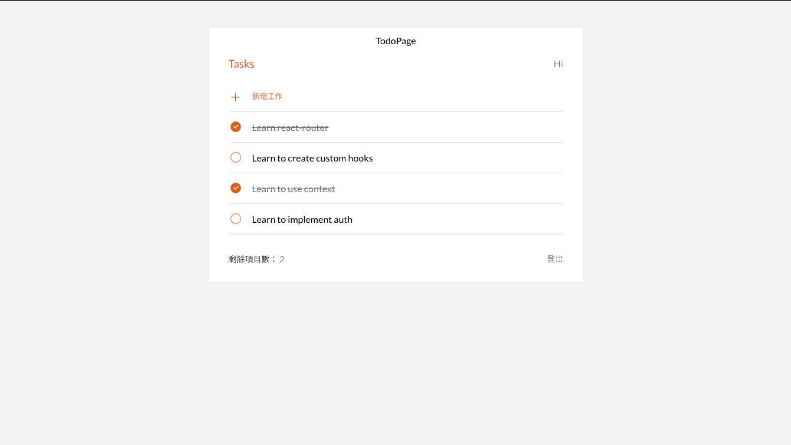

# Todo List X MVC with React

_This is frist submit of M7_

## Table of contents

- [Overview](#overview)
  - [The challenge](#the-challenge)
  - [Screenshot](#screenshot)
  - [Links](#links)
- [My process](#my-process)
  - [Built with](#built-with)
  - [API](#api)
  - [What I learned](#what-i-learned)
  - [Useful resources](#useful-resources)
- [Author](#author)
- [Acknowledgments](#acknowledgments)

## Overview

### The challenge

- This project was bootstrapped with [Create React App](https://github.com/facebook/create-react-app).
- Users can login to edit personal to-dos.
- Users can create, revise, and delete to-dos in the app.

### Screenshot



### Links

- Solution URL: [https://github.com/Chious/M7-todo-list](https://github.com/Chious/M7-todo-list)
- Live Site URL: [https://chious.github.io/M7-todo-list/](https://chious.github.io/M7-todo-list/)

## My process

### Built with

- Semantic HTML5 markup
- React
- [React Router](https://reactrouter.com/en/main) -- help to design multiple page
- [clsx](https://www.npmjs.com/package/clsx) -- help to setup css quickly by className
- [sweetalert](https://sweetalert2.github.io) -- friendly design for popup
- [axios](https://www.npmjs.com/package/axios) -- send http request to backend

### API

#### Edit Todos

| Name       | Explain                          | HTTP Verb | API Request URI       |
|------------|----------------------------------|-----------|-----------------------|
| getTodos   | View to-do data                  | GET       | {{API_URI}}/todos     |
| createTodo | Create new to-do to backend      | POST      | {{API_URI}}/todos     |
| patchTodo  | Revise exist to-do with new data | PATCH     | {{API_URI}}/todos/:id |
| deleteTodo | Delete exist to-do               | DELETE    | {{API_URI}}/todos/:id |

#### Authorization

| Name          | Explain                      | HTTP Verb | API Request URI                 |
|---------------|------------------------------|-----------|---------------------------------|
| Register      | Register new account         | POST      | {{API_URI}}/api/auth/register   |
| Login         | Login to exist account       | POST      | {{API_URI}}/api/auth/login      |
| Authorization | Check if user has been login | GET       | {{API_URI}}/api/auth/test-token |

### What I learned

1. Why and how to use Router?

- Since we browser to different page, it would send a request to backend and re-render the page. `Router` gives a more efficiency way to upload the page.

- How to use Router?

```js
import {BrowserRouter,Routes,Route,} from "react-router-dom";

  <BrowserRouter>
    <Routes>
      <Route path="/" element={<App />}>
        <Route index element={<Home />} />
        <Route path="teams" element={<Teams />}>
          <Route path=":teamId" element={<Team />} />
          <Route path="new" element={<NewTeamForm />} />
          <Route index element={<LeagueStandings />} />
        </Route>
      </Route>
    </Routes>
  </BrowserRouter>

// Use <Link/> to control navigation of the page
<Link to="about">About</Link>
```

2. How to trigger funtion from children to mother component

For example:

```js
// This would trigger function onToggleDone that define on mother component with data todo.id
<span
  className="icon icon-checked"
  onClick={() => {
    onToggleDone?.(todo.id);
  }}
/>
```
3. How to authorization access token by http request in `axois` (as copy from comment in [stackoverflow](https://stackoverflow.com/questions/40988238/sending-the-bearer-token-with-axios))

```
const config = {
    headers: { Authorization: `Bearer ${token}` }
};

const bodyParameters = {
   key: "value"
};

Axios.post( 
  'http://localhost:8000/api/v1/get_token_payloads',
  bodyParameters,
  config
).then(console.log).catch(console.log);
```

The first parameter is the URL. <br/>
The second is the JSON body that will be sent along your request. <br/>
The third parameter are the headers (among other things). Which is JSON as well.

### Useful resources

- [How to use React Router(Youtube Video)](https://www.youtube.com/watch?v=Bi0PCx8kZP4&list=PLODGJVEE6JCwCOTcJjs58iV5e6iVIBrpO&index=6)
- [useState](https://react.dev/reference/react/useState) -- help to define event and handler by React.
- [react-script build conflict(Private Discord Discussion)](https://discord.com/channels/925294714217967647/1159024050476167230/1159024050476167230)
- [JWT](https://jwt.io) -- This project follow JWT Token to make sure authorization is completed from user side.

## Author

- Github - [Chious](https://github.com/Chious)
